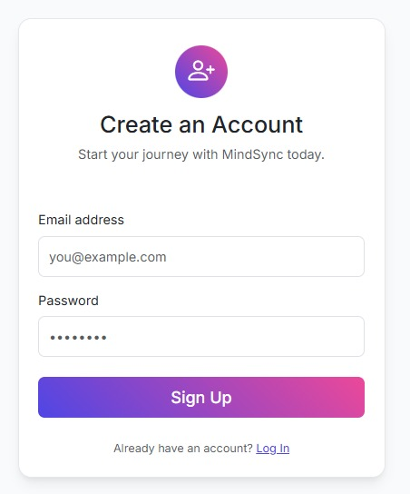
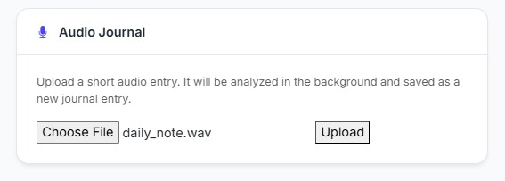
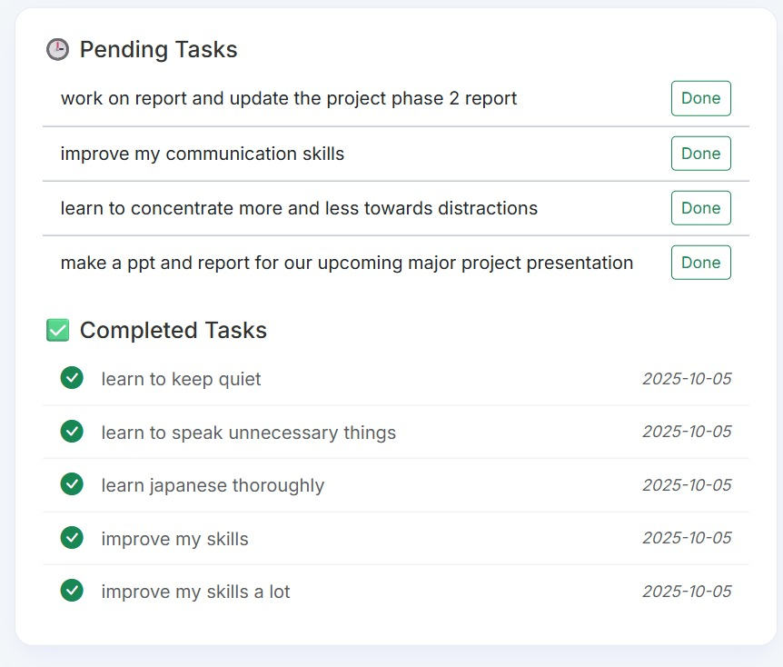
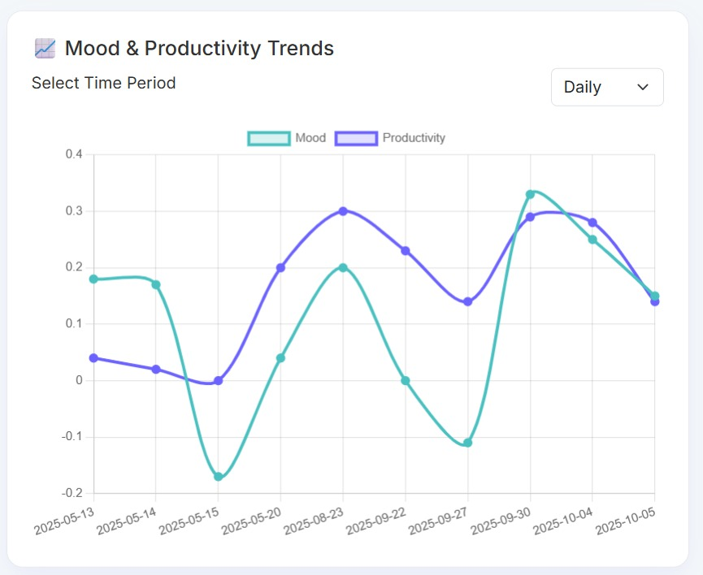
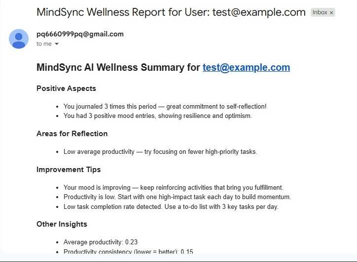
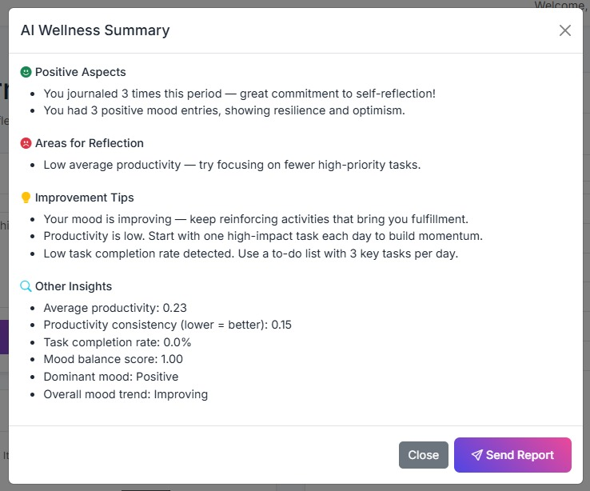
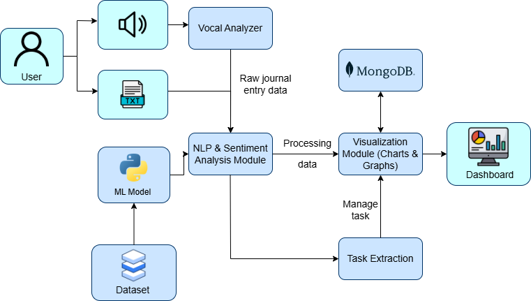

# 🧠 MindSync - An Intelligent Journaling Tool

> **Your thoughts deserve more than just storage—they deserve understanding.**

MindSync Journal is an intelligent, AI-powered journaling platform that transforms your daily reflections into meaningful insights. By combining the therapeutic power of journaling with advanced Natural Language Processing (NLP), MindSync helps you understand your emotional patterns, track productivity, and discover actionable insights from your own words.

Whether you're a student managing stress, a professional tracking productivity, or someone on a personal growth journey, MindSync is your digital companion for self-discovery.

---

<div align="center">


**Transform Your Thoughts Into Actionable Insights**

_An AI-powered intelligent journaling platform that understands your emotions, tracks productivity, and reveals patterns in your daily life through advanced NLP._

[](https://www.python.org/)
[](https://flask.palletsprojects.com/)
[](https://www.mongodb.com/cloud/atlas)
[](LICENSE)

</div>

---

## 📌 Table of Contents

- [📖 About](#-about)
- [✨ Key Features](#-key-features)
- [🏗️ Architecture](#️-architecture)
- [📸 Screenshots & Features](#-screenshots--features)
- [🛠️ Tech Stack](#️-tech-stack)
- [🚀 Getting Started](#-getting-started)
- [📖 Usage Guide](#-usage-guide)
- [📁 Project Structure](#-project-structure)
- [🔌 API Reference](#-api-reference)
- [🎯 Key Algorithms & Methodology](#-key-algorithms--methodology)
- [🔒 Security Features](#-security-features)
- [📊 Database Schema](#-database-schema)
- [🚀 Performance Optimization](#-performance-optimization)
- [🤝 Contributing](#-contributing)
- [🔮 Future Enhancements](#-future-enhancements)
- [🙏 Acknowledgments](#-acknowledgments)
- [💬 Support & Contact](#-support--contact)
- [📄 License](#-license)

---

## 📖 About

In our fast-paced world, genuine self-reflection is a luxury many overlook. **MindSync Journal** is revolutionizing personal wellness by combining the therapeutic power of journaling with cutting-edge artificial intelligence.

**MindSync** isn't just another diary app—it's your **personal mental health analyst**. By leveraging advanced Natural Language Processing (NLP), the platform transforms raw journal entries into meaningful, actionable insights about your emotional patterns, productivity levels, and overall well-being.

### 🎯 Vision

Create a judgment-free digital sanctuary where users can:

- 📝 Journal freely without pressure or formatting
- 🤖 Receive intelligent, unbiased emotional analysis
- 📊 Visualize patterns that emerge from their thoughts
- ✅ Automatically organize actionable tasks from their reflections
- 🔐 Maintain complete privacy and security of their innermost thoughts

---

## ✨ Key Features

| Feature                               | Description                                                                                                                   |
| ------------------------------------- | ----------------------------------------------------------------------------------------------------------------------------- |
| 🧠 **AI-Powered Sentiment Analysis**  | Uses **TextBlob + VADER** to classify mood as positive, neutral, or negative with precision confidence scores.                |
| 📈 **Dynamic Productivity Scoring**   | Custom algorithm analyzes linguistic patterns to calculate daily productivity metrics.                                        |
| ✅ **Intelligent Task Extraction**    | Automatically detects action items using regex patterns for phrases like _"I need to..."_, _"must do..."_, _"planning to..."_ |
| 🔐 **Military-Grade Security**        | **Bcrypt password hashing** + **Flask-Login** session management ensures your data stays private.                             |
| 📊 **Interactive Data Visualization** | Real-time **Chart.js** dashboards showing mood & productivity trends across multiple timeframes.                              |
| 🗓️ **Smart Day View**                 | Dedicated interface for reviewing, bulk-selecting, and deleting entries with ease.                                            |
| 🎤 **Audio Journal Support**          | Record audio entries that are automatically transcribed and analyzed.                                                         |
| 📧 **Report Generation**              | Export wellness summaries and send reports to healthcare providers.                                                           |
| 🎲 **AI Prompts**                     | Get personalized journaling prompts to overcome writer's block.                                                               |
| 📱 **Responsive Design**              | Seamless experience across desktop, tablet, and mobile devices.                                                               |

---

## 🏗️ Architecture

### **System Design**

```
┌─────────────────────────────────────────────────────────────┐
│                        USER BROWSER                         │
│         (HTML5 + CSS3 + JavaScript + Bootstrap 5)           │
└────────────────────────┬────────────────────────────────────┘
                         │ HTTP/AJAX
                         ▼
┌─────────────────────────────────────────────────────────────┐
│                    FLASK WEB SERVER                         │
│  ┌──────────────────────────────────────────────────────┐   │
│  │ • Authentication & Session Management                │   │
│  │ • Route Handling & Business Logic                    │   │
│  │ • Audio Processing & Transcription                   │   │
│  │ • Report Generation & Email Services                 │   │
│  └──────────────────────────────────────────────────────┘   │
└────────────────────────┬────────────────────────────────────┘
                         │ PyMongo Driver
                         ▼
┌─────────────────────────────────────────────────────────────┐
│                    MONGODB ATLAS CLOUD                      │
│  ┌──────────────────────────────────────────────────────┐   │
│  │ Collections: users | entries | tasks                 │   │
│  │ Indexed Queries | Aggregation Pipeline               │   │
│  └──────────────────────────────────────────────────────┘   │
└─────────────────────────────────────────────────────────────┘

              ┌──────────────────────────────────┐
              │      NLP PROCESSING ENGINE       │
              │  ┌──────────────────────────────┐│
              │  │ TextBlob (Polarity Analysis) ││
              │  │ VADER (Sentiment Scoring)    ││
              │  │ NLTK (Tokenization)          ││
              │  │ Regex (Task Extraction)      ││
              │  └──────────────────────────────┘│
              └──────────────────────────────────┘
```

### **Workflow Pipeline**

```
Journal Entry
     │
     ▼
Text Analysis (TextBlob + VADER)
     │
     ├─────► Mood Classification (Positive/Neutral/Negative)
     │
     └─────► Productivity Scoring

     ▼
Task Extraction (Regex Patterns)
     │
     └─────► Database Storage + Task List Update

     ▼
Data Aggregation & Visualization
     │
     ├─────► Daily Charts
     ├─────► Weekly Trends
     └─────► Monthly Reports
```

---

## 📸 Screenshots & Features

### 🔐 Authentication System

<p align="center">
  
</p>

**Features:**

- Clean, intuitive login/register interface
- Secure password hashing with Bcrypt
- Session management with Flask-Login
- Account validation and error handling

---

### 📊 Dashboard & Analytics

<p align="center">
  
</p>

**Your Personal Command Center:**

- **Mood Trends**: Visual representation of emotional patterns
- **Productivity Insights**: Track your productive output over time
- **Quick Stats**: Latest entries and tasks at a glance
- **Interactive Charts**: Click through different time periods

---

### 📝 Daily Entry View

<p align="center">
  
</p>

**Journal Entry Features:**

- Rich text input for detailed journaling
- **Audio Recording**: Speak your thoughts instead of typing
- Real-time mood detection
- Automatic task extraction
- Timestamp tracking

---

### ✅ Pending Tasks Management

<p align="center">
  
</p>

**Smart Task Organization:**

- Automatically extracted from journal entries
- Mark tasks as complete with one click
- Visual status indicators
- Quick task overview

---

### 📈 Trend Analytics

<p align="center">
  
</p>

**Advanced Visualizations:**

- **Daily Trends**: Hour-by-hour mood changes
- **Weekly Patterns**: Identify your best and worst days
- **Monthly Overview**: Long-term emotional arc
- **Productivity Correlation**: See how mood affects output

---

### 📧 Email Reports

<p align="center">
  
</p>

**Healthcare Integration:**

- Generate AI wellness summaries
- Send secure reports to healthcare providers
- HIPAA-compliant data handling
- Export ready formats

---

### 🧠 AI-Generated Insights

<p align="center">
  
</p>

**Intelligent Analysis:**

- **Positive Aspects**: Highlights your strengths
- **Areas for Reflection**: Constructive feedback
- **Improvement Tips**: Actionable recommendations
- **Other Factors**: Context and patterns identified

---

### 🏗️ System Architecture

<p align="center">
  
</p>

**Complete System Design:**

- Client-Server architecture
- Microservices integration
- Cloud-based data storage
- Real-time processing pipeline

---

## 🛠️ Tech Stack

### **Frontend**

-  **HTML5** - Semantic markup
-  **CSS3** - Advanced styling & animations
-  **JavaScript** - Interactive functionality
-  **Bootstrap 5** - Responsive framework
-  **Chart.js** - Data visualization

### **Backend**

-  **Python 3.10+** - Core language
-  **Flask** - Web framework
-  **PyMongo** - MongoDB driver

### **Database**

-  **MongoDB Atlas** - Cloud database
- Aggregation Pipelines for complex queries
- Indexed collections for performance

### **NLP & Analysis**

-  **TextBlob** - Sentiment analysis
-  **NLTK + VADER** - Advanced NLP
- **Regex Pattern Matching** - Task extraction
- **Custom Scoring Algorithm** - Productivity metrics

### **Security & Authentication**

-  **Flask-Bcrypt** - Password hashing
-  **Flask-Login** - Session management
- HTTPS support ready

### **Additional Libraries**

- **Flask-Mail** - Email notifications
- **OpenAI Whisper** - Audio transcription
- **Google Cloud Speech** - Speech recognition
- **OpenCV** - Image processing
- **FER** - Facial emotion recognition

---

## 🚀 Getting Started

### **Prerequisites**

Ensure you have the following installed:

- **Python 3.10+** ([Download](https://www.python.org/downloads/))
- **pip** (comes with Python)
- **Git** ([Download](https://git-scm.com/))
- **MongoDB Atlas Account** ([Create Free Account](https://www.mongodb.com/cloud/atlas))

### **Installation & Setup**

#### **Step 1: Clone the Repository**

```bash
git clone https://github.com/Prashanth-000/Mind-Sync_Project-using-NLP.git
cd mind-sync-journal
```

#### **Step 2: Create and Activate Virtual Environment**

```bash
# Windows
python -m venv venv
.\venv\Scripts\activate

# macOS/Linux
python3 -m venv venv
source venv/bin/activate
```

#### **Step 3: Install Dependencies**

```bash
pip install -r requirements.txt
```

#### **Step 4: Configure Environment Variables**

Create a `.env` file in the project root:

```env
# MongoDB Configuration
MONGO_CLUSTER_URL="mongodb+srv://<username>:<password>@cluster-name.mongodb.net/?retryWrites=true&w=majority"

# Email Configuration
MAIL_SERVER="smtp.gmail.com"
MAIL_PORT=587
MAIL_USE_TLS=True
MAIL_USERNAME="your-email@gmail.com"
MAIL_PASSWORD="your-app-password"

# Healthcare Provider Email
HEALTHCARE_CENTER_EMAIL="healthcare@example.com"

# API Keys (Optional)
GOOGLE_API_KEY="your-google-api-key"
OPENAI_API_KEY="your-openai-api-key"
```

#### **Step 5: Run the Application**

```bash
flask run
```

Open your browser and navigate to: **[http://127.0.0.1:5000](http://127.0.0.1:5000)**

---

## 📖 Usage Guide

### **Creating Your First Entry**

1. **Login to Your Account**

   - Enter your registered email and password
   - Click "Sign In"

2. **Write a Journal Entry**

   - Click on the journal entry box
   - Write freely about your day, thoughts, or feelings
   - Or record an audio entry

3. **Automatic Analysis**
   - **Mood Detection**: AI analyzes your text in real-time
   - **Productivity Score**: Custom algorithm rates your output
   - **Task Extraction**: Any action items are automatically added to your task list

### **Viewing Your Insights**

1. **Navigate to Insights**

   - Click the "Insights" button in the sidebar
   - Choose your preferred timeframe:
     - **Weekly**: Last 7 days summary
     - **Monthly**: Last 30 days analysis
     - **All Time**: Complete history insights

2. **Understand Your Data**
   - **Positive Aspects**: Things you're doing well
   - **Areas for Reflection**: Challenges to address
   - **Improvement Tips**: Personalized recommendations
   - **Other Factors**: Additional patterns and observations

### **Managing Tasks**

1. **View Pending Tasks**

   - All tasks appear in the "Pending Tasks" section
   - Extracted directly from your entries

2. **Complete a Task**

   - Click the checkmark next to a task
   - Completed tasks move to history

3. **Day View Management**
   - Click a specific date to enter Day View
   - Bulk select and delete entries
   - Review all entries for that day

### **Generating Reports**

1. **Create a Report**

   - Go to Insights page
   - Click "Generate Report"
   - System creates AI-powered wellness summary

2. **Send to Healthcare Provider**
   - Click "Send to Provider"
   - Report is securely emailed
   - Includes mood data, productivity metrics, and AI analysis

---

## 📁 Project Structure

```
mood_journal_project/
├── 📄 app.py                          # Main Flask application
├── 📄 models.py                       # User model & database schemas
├── 📄 requirements.txt                # Python dependencies
├── 📄 Procfile                        # Heroku deployment config
│
├── 📁 database/
│   ├── db.py                          # MongoDB connection & queries
│   ├── ClearDB.py                     # Database utility functions
│   └── __pycache__/
│
├── 📁 nlp/                            # NLP & Analysis Engine
│   ├── analysis.py                    # Sentiment & mood analysis
│   ├── task_extractor.py              # Task extraction logic
│   ├── scorer.py                      # Productivity scoring
│   ├── summarizer.py                  # Insight generation
│   ├── media_analyzer.py              # Audio/media processing
│   └── __pycache__/
│
├── 📁 static/                         # Frontend Assets
│   └── css/
│       ├── login.css                  # Login page styles
│       ├── register.css               # Register page styles
│       └── day_view.css               # Day view styles
│   └── js/
│       └── day_view.js                # Day view interactions
│
├── 📁 templates/                      # HTML Templates
│   ├── layout.html                    # Base template
│   ├── index.html                     # Dashboard
│   ├── login.html                     # Login page
│   ├── register.html                  # Register page
│   ├── day_view.html                  # Day view page
│   └── insights.html                  # Insights page
│
├── 📁 Datasets/                       # Training Data
│   └── Emotion/
│       ├── train_converted.csv        # Training dataset
│       ├── test_converted.csv         # Testing dataset
│       └── accuracy.py                # Model evaluation
│
├── 📁 images/                         # Screenshots & Assets
│   ├── architecture.png
│   ├── DashBoard.jpg
│   ├── loginNregister.jpg
│   ├── AudioInput.jpg
│   ├── PendingTask.jpg
│   ├── TredndChart.jpg
│   ├── EmailReport.jpg
│   └── Summery.jpg
│
└── 📁 utils/                          # Utility Functions
    └── scorer.py                      # Helper scoring functions

```

---

## 🔌 API Reference

### **Authentication Endpoints**

#### **POST `/login`**

```json
Request:
{
  "email": "user@example.com",
  "password": "password123"
}

Response (Success):
{
  "status": "success",
  "message": "Logged in successfully"
}
```

#### **POST `/register`**

```json
Request:
{
  "email": "newuser@example.com",
  "password": "securepassword"
}

Response (Success):
{
  "status": "success",
  "message": "Account created successfully"
}
```

---

### **Journal Entry Endpoints**

#### **POST `/submit_journal_ajax`**

Submit a new journal entry with automatic analysis

```json
Request:
{
  "journal": "Today was a great day. I need to finish the report and call my mom."
}

Response:
{
  "mood": "positive",
  "productivity": 7.5,
  "date": "2024-12-04",
  "tasks": ["finish the report", "call my mom"]
}
```

---

### **Audio Processing Endpoint**

#### **POST `/api/analyze_audio`**

Upload and analyze audio journal entries

```
Request: multipart/form-data with audio_file (WAV format)

Response:
{
  "message": "Audio file has been successfully analyzed and saved as a new journal entry."
}
```

---

### **Data Visualization Endpoints**

#### **GET `/api/chart_data/<period>`**

Fetch chart data for visualization

```
Parameters:
- period: "daily" | "weekly" | "monthly"

Response:
[
  {
    "label": "2024-12-04",
    "productivity": 7.2,
    "mood": 0.8
  },
  ...
]
```

---

### **Insights & Reports**

#### **GET `/api/get_summary/<period>`**

Generate AI wellness summary

```
Parameters:
- period: "day" | "week"

Response:
{
  "positive_aspects": ["Great productivity today", "Stayed focused"],
  "negative_aspects": ["Felt stressed in the afternoon"],
  "improvement_tips": ["Try taking regular breaks"],
  "other_factors": ["Weather was sunny - mood boost!"]
}
```

#### **POST `/api/send_report`**

Send wellness report to healthcare provider

```json
Request:
{
  "summary": { /* summary data */ }
}

Response:
{
  "success": true,
  "message": "Report sent successfully!"
}
```

---

### **Task Management Endpoints**

#### **POST `/complete_task/<task_id>`**

Mark a task as completed

```
Response:
{
  "success": true,
  "message": "Task marked as complete."
}
```

---

### **Day View Endpoints**

#### **GET `/day_view/<date>`**

View all entries for a specific date

```
Parameters:
- date: "YYYY-MM-DD"

Response: HTML page with all entries for that date
```

#### **POST `/delete_entries`**

Delete multiple entries

```
Request:
- entry_ids: ["id1", "id2", ...]
- date: "YYYY-MM-DD"

Response: Redirect to updated day view
```

---

## 🎯 Key Algorithms & Methodology

### **Sentiment Analysis Pipeline**

```python
1. Text Preprocessing
   ↓
2. TextBlob Polarity Analysis (-1 to +1)
   ↓
3. VADER Sentiment Scoring
   ↓
4. Threshold-Based Classification
   - Positive (polarity > 0.2)
   - Neutral (-0.2 ≤ polarity ≤ 0.2)
   - Negative (polarity < -0.2)
   ↓
5. Confidence Score Assignment
```

### **Task Extraction Algorithm**

Uses regex pattern matching to identify action phrases:

- "need to..." → Extract action
- "have to..." → Extract action
- "must..." → Extract action
- "should..." → Extract action
- "planning to..." → Extract action
- "todo:" → Extract action

### **Productivity Scoring**

Calculates based on:

- **Sentence Density**: More sentences = higher activity
- **Action Verbs**: Count of action-oriented words
- **Time References**: Mentions of specific times/deadlines
- **Negative Indicators**: Procrastination signals reduce score
- **Consistency**: Regular entries boost score

---

## 🔒 Security Features

✅ **Password Security**

- Bcrypt hashing with salt rounds
- No plaintext password storage
- Secure password reset workflow

✅ **Session Management**

- Flask-Login session handling
- CSRF protection on forms
- Secure cookie settings

✅ **Data Privacy**

- User data isolation by user_id
- No cross-user data access
- MongoDB access controls

✅ **Input Validation**

- XSS prevention
- SQL injection prevention
- Secure file upload handling

---

## 📊 Database Schema

### **Users Collection**

```json
{
  "_id": ObjectId,
  "email": "user@example.com",
  "password_hash": "bcrypt_hash",
  "created_at": ISODate,
  "last_login": ISODate
}
```

### **Entries Collection**

```json
{
  "_id": ObjectId,
  "user_id": ObjectId,
  "date": "2024-12-04",
  "text": "Journal entry content...",
  "mood": "positive",
  "productivity": 7.5,
  "created_at": ISODate
}
```

### **Tasks Collection**

```json
{
  "_id": ObjectId,
  "user_id": ObjectId,
  "entry_id": ObjectId,
  "task_text": "Finish the report",
  "completed": false,
  "created_at": ISODate,
  "completed_at": ISODate
}
```

---

## 🚀 Performance Optimization

- **Database Indexing**: Optimized queries on user_id, date
- **Lazy Loading**: Chart data loaded on demand
- **Caching**: Frequent calculations cached
- **Async Processing**: Background thread for audio analysis
- **CDN Ready**: Static files optimized for delivery

---

## 🤝 Contributing

We welcome contributions! Here's how you can help:

1. **Fork the Repository**

   ```bash
   git clone https://github.com/Prashanth-000/Mind-Sync_Project-using-NLP.git
   ```

2. **Create a Feature Branch**

   ```bash
   git checkout -b feature/amazing-feature
   ```

3. **Commit Your Changes**

   ```bash
   git commit -m 'Add amazing feature'
   ```

4. **Push to Branch**

   ```bash
   git push origin feature/amazing-feature
   ```

5. **Open a Pull Request**
   - Describe your changes
   - Link relevant issues
   - Include screenshots if UI changes

---

## 🔮 Future Enhancements

- **Advanced Topic Modeling:** Identify key life themes using LDA (e.g., "work," "family," "health").
- **AI-Powered Summaries:** Weekly generated summaries and encouragement using LLM APIs.
- **Custom Reminders:** Push notifications & email reminders for journaling.
- **Full-Text Search:** Search past entries using MongoDB text indexes.

---

## 🙏 Acknowledgments

- **TextBlob & NLTK** - For powerful NLP capabilities
- **MongoDB** - For reliable cloud database
- **Flask** - For elegant web framework
- **Bootstrap** - For beautiful responsive design
- **Chart.js** - For stunning data visualizations
- **Community** - For feedback and contributions

---

## 💬 Support & Contact

Got questions or need help?

- **Report Issues**: [GitHub Issues](https://github.com/Prashanth-000/Mind-Sync_Project-using-NLP/issues)
- **Email**: prashanthkulal2589@gmail.com
- **Documentation**: Check our [Wiki](https://github.com/Prashanth-000/Mind-Sync_Project-using-NLP/wiki)

---

## 📄 License

This project is licensed under the MIT License - see the [LICENSE](LICENSE) file for details.

---

## 💡 Final Notes

MindSync is designed to **empower personal growth** through actionable data insights. Its modular architecture ensures it can grow with future features like AI-driven analysis and smart reminders.

> _"Your journal is more than just words — it's a map of your mind."_

---

<div align="center">

### Made with ❤️ by PFB-000

**[GitHub](https://github.com/Prashanth-000)**

</div>
